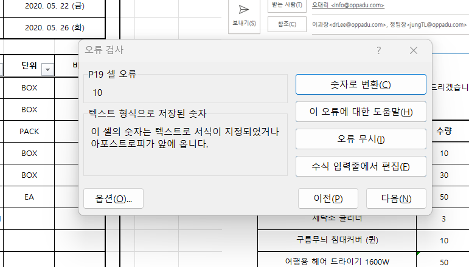
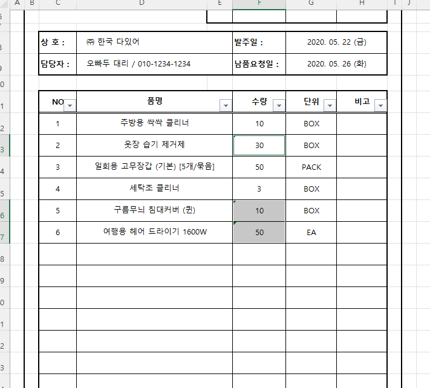
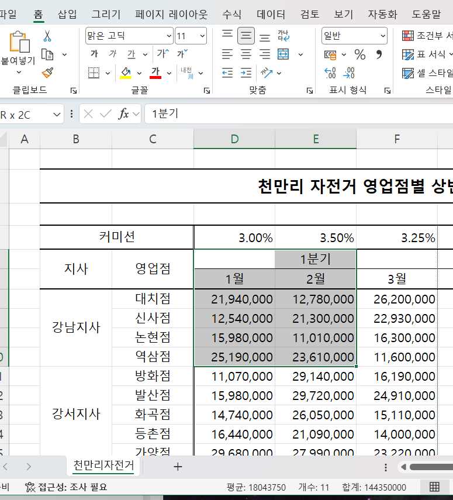

# Excel 1주차 정규 과제 

📌Excel 정규과제는 매주 정해진 분량의 『*진짜 쓰는 실무 엑셀*』 을 읽고 학습하는 것입니다. 이번주는 아래의 **EXCEL_1st_TIL**에 나열된 분량을 읽고 공부하시면 됩니다.

아래의 문제를 풀어보며 학습 내용을 점검하세요. 문제를 해결하는 과정에서 개념을 스스로 정리하고, 필요한 경우 제시된 강의를 참고하여 보완하는 것이 좋습니다.

**교재 실습 예제 파일은 1주차 과제 설명 노션에 있습니다. 해당 파일을 다운 후 실습 진행해주시면 됩니다.**

**👀(수행 인증샷은 필수입니다.)** 

## EXCEL_1st_TIL

### 1장 시작부터 남다른 실무자의 엑셀 활용
#### 01. 엑셀 기본 설정 변경으로 맞춤 환경 만들기 (범위 제외)
#### 02. 엑셀 좀 사용하려면 반드시 알아야 할 엑셀 기본키 (범위 제외)
#### 03. 엑셀의 기본 동작 원리 이해하기
#### 04. 엑셀에서 발생하는 모든 오류와 해결 방법 총정리
#### 05. 실무자면 꼭 알아야 할, 필수 단축키 모음

### 2장 실무자라면 반드시 알아야 할 엑셀 활용
#### 01. 보기 좋은 표, 활용할 수 있는 데이터를 위한 필수 상식
#### 02. 편리한 엑셀 문서 작업을 위한 실력 다지기
#### 03. 엑셀로 시작하는 기초 데이터 분석
#### 02. 엑셀 데이터 가공을 위한 텍스트 나누고 합치기

## Study Schedule

| 주차  | 공부 범위     | 완료 여부 |
| ----- | ------------- | --------- |
| 1주차 | p.22~111    | ✅         |
| 2주차 | p.112~157   | 🍽️         |
| 3주차 | p.158~213  | 🍽️         |
| 4주차 | p.214~273 | 🍽️         |
| 5주차 | p.274~339 | 🍽️         |
| 6주차 | p.340~425 | 🍽️         |
| 7주차 | p.426~472 | 🍽️         |

 

<!-- 여기까진 그대로 둬 주세요-->

---

# 1️⃣ 학습 내용 정리

## 01-3. 엑셀의 기본 동작 원리 이해하기
> **셀 참조 방식에 대해 정리해주세요.**
<!-- 셀 참조 방식에 대해 정리해주세요. --> 엑셀의 셀 참조 방식에는 상대참조, 절대참조, 혼합참조가 있습니다,
상대참조 (A1) : 수식을 다른 셀로 복사하면 행과 열이 이동한 위치에 맞게 함께 변경된다
절대참조 ($A$1) : 수식을 복사해도 참조하는 행과 열이 모두 고정된다. 세율이나 환율처럼 하나의 값을 계속 사용할 때 유용하다
혼합참조 ($A1,A$1) : 행이나 열 중 하나만 고정하는 방식이다. $A1은 열을 고정하고, A$1은 행을 고정한다.

## 01-4. 엑셀에서 발생하는 모든 오류와 해결 방법 총정리
> **숫자처럼 보이는 문자를 빠르게 확인하고 해결하기(51 ~52p)를 진행 후 인증사진을 첨부해주세요.**

## 01-5. 실무자면 꼭 알아야 할, 필수 단축키 모음
> **이번에 배운 단축키에 대해 정리해주세요.**
<!-- 여기에 정리해주세요. -->
| 단축키                                | 기능                 |
| ---------------------------------- | ------------------ |
| `Ctrl + S`                         | 현재 파일 저장           |
| `F12`                              | 다른 이름으로 저장         |
| `Shift + F11`                      | 새로운 워크시트 삽입        |
| `Ctrl + N`                         | 새로운 통합 문서 생성       |
| `Ctrl + Tab`                       | 열려 있는 통합 문서 사이 이동  |
| `Alt + Tab`                        | 실행 중인 프로그램 사이 이동   |
| `Ctrl + PageUp / PageDown`         | 이전 또는 다음 시트로 이동    |
| `Ctrl + Shift + PageUp / PageDown` | 연속된 여러 시트 선택       |
| `Ctrl + 마우스 휠`                     | 화면 확대·축소           |
| `Ctrl + Alt + + / -`               | 화면 확대·축소           |
| `Ctrl + P`                         | 인쇄 미리 보기           |
| `Alt → P → R → S`                  | 선택한 범위를 인쇄 영역으로 설정 |
| 단축키                 | 기능                   |
| ------------------- | -------------------- |
| `Alt`               | 리본 메뉴의 기능별 단축키 표시    |
| `Shift + F10`       | 마우스 오른쪽 버튼의 팝업 메뉴 열기 |
| `Ctrl + F1`         | 리본 메뉴 숨기기·표시하기       |
| `Ctrl + Shift + F1` | 전체 화면 모드로 전환         |
| `Ctrl + Shift + U`  | 수식 입력줄 확대·축소         |
| `Alt → W → F → F`   | 틀 고정 실행              |
| `Ctrl + Shift + L`  | 자동 필터 적용·해제          |
| `Alt + ↓`           | 필터 또는 드롭다운 메뉴 열기     |
| 단축키              | 기능                             |
| ---------------- | ------------------------------ |
| `Ctrl + A`       | 연속된 데이터 범위 선택, 한 번 더 누르면 전체 선택 |
| `Alt + Enter`    | 한 셀 안에서 줄 바꿈                   |
| `Ctrl + C / V`   | 복사 / 붙여넣기                      |
| `Ctrl + Alt + V` | 선택하여 붙여넣기 창 열기                 |
| `Ctrl + F / H`   | 찾기 / 찾아 바꾸기                    |
| `F4`             | 이전 작업 반복                       |
| `F2`             | 활성화된 셀을 편집 모드로 전환              |
| `Ctrl + Z / Y`   | 실행 취소 / 다시 실행                  |
| `Ctrl + Enter`   | 선택한 여러 셀에 같은 값이나 수식 입력         |
| `Ctrl + + / -`   | 행·열·셀 삽입 / 삭제                  |
| `Ctrl + D`       | 선택 범위의 첫 번째 값을 아래쪽으로 채우기       |
| `Ctrl + R`       | 선택 범위의 첫 번째 값을 오른쪽으로 채우기       |
| `Ctrl + E`       | 빠른 채우기 실행                      |
| 단축키                | 기능                        |
| ------------------ | ------------------------- |
| `Ctrl + \`         | 선택 범위에서 좌우 값이 다른 셀 선택     |
| `Ctrl + Shift + \` | 선택 범위에서 상하 값이 다른 셀 선택     |
| `Ctrl + [`         | 현재 수식이 참조하는 셀 선택          |
| `Ctrl + ]`         | 현재 셀을 참조하는 셀 선택           |
| `Ctrl + Shift + [` | 수식이 참조하는 이전 단계의 모든 셀 선택   |
| `Ctrl + Shift + ]` | 현재 셀을 참조하는 이후 단계의 모든 셀 선택 |
| 단축키                | 기능                     |
| ------------------ | ---------------------- |
| `Ctrl + 1`         | 셀 서식 대화상자 열기           |
| `Alt → H → B → A`  | 선택 범위에 모든 테두리 적용       |
| `Ctrl + Shift + 7` | 선택 범위의 바깥쪽 테두리 적용      |
| `Ctrl + Shift + -` | 선택 범위의 테두리 제거          |
| `Alt → H → H → N`  | 채우기 색 제거               |
| `Ctrl + Shift + ~` | 일반 서식 적용               |
| `Ctrl + Shift + 1` | 천 단위 구분기호가 있는 숫자 서식 적용 |
| `Ctrl + Shift + 2` | 시간 서식 적용               |
| `Ctrl + Shift + 3` | 날짜 서식 적용               |
| `Ctrl + Shift + 4` | 통화 서식 적용               |
| `Ctrl + Shift + 5` | 백분율 서식 적용              |
| `Ctrl + Shift + 6` | 지수 서식 적용               |
| 단축키                | 기능            |
| ------------------ | ------------- |
| `Alt + Shift + →`  | 선택한 행이나 열 그룹화 |
| `Alt + Shift + ←`  | 그룹화 해제        |
| `Ctrl + 9`         | 선택한 행 숨기기     |
| `Ctrl + 0`         | 선택한 열 숨기기     |
| `Ctrl + Shift + 9` | 숨긴 행 다시 표시    |
| `Ctrl + Shift + 0` | 숨긴 열 다시 표시    |

## 02-1. 보기 좋은 표, 활용할 수 있는 데이터를 위한 필수 상식
> **데이터와 표를 비교해주세요**
<!-- 여기에 정리해주세요. -->
1. 목적
(1) 표 : 사람이 내용을 보기 편하도록 시각적으로 정리 
(2) 데이터 : 엑셀 기능을 활용해 값을 관리하고 분석 
2.구조
(1) 표 : 항목이 가로와 세로 방향으로 함께 배치
(2) 데이터 : 각 열에는 하나의 항목을 입력하고, 새로운 내용을 행 방향으로 누적
3. 값 검색
(1) 표 : 순위나 특정 값을 찾기 위해 별도의 함수가 필요할 수 있음
(2) 데이터 : 정렬과 필터 기능으로 원하는 값을 쉽게 확인
4. 데이터 추가
(1) 표 : 새로운 기간이나 구분자가 생기면 표의 전체 구조를 수정해야 할 수 있음
(2) 데이터 : 기존 열의 기준을 유지하면서 새로운 행만 추가
5. 빈칸 발생
(1) 표 : 직원 변동 등으로 표 중간에 빈칸이 생길 수 있음
(2) 데이터 :필요한 값만 행 단위로 계속 입력하여 관리
6. 활용
(1) 표 : 보기에는 편하지만 데이터 가공에는 불편할 수 있음
(2) 데이터 : 함수, 정렬, 필터, 피벗 테이블 등을 편리하게 활용할 수 있음

> **셀 병합 기능을 자제해야 하는 이유를 정리해주세요.**
<!-- 여기에 정리해주세요. -->
1. 셀이나 데이터 범위를 자유롭게 선택하기 어렵다
2. 선택한 범위를 수정하거나 편집하는 데 제약이 생긴다
3. 표 기능과 피벗 테이블을 제대로 활용하기 어렵다
4. 자동 채우기의 기능이 정상적으로 작동하지 않을 수 있다
5. 데이터 정렬 기능을 사용할 수 없다
6. 함수를 사용할 때 의도와 다른 결과가 계산될 수 있다.

## 02-2. 편리한 엑셀 문서 작업을 위한 실력 다지기
> **셀 병합하지 않고 가운데 정렬하(75 ~77p)를 진행 후 인증사진을 첨부해주세요.**

> **셀 병합 해제 후 빈칸 쉽게 체우기(78 ~79p)를 진행 후 인증사진을 첨부해주세요.**
<!-- 이 부분을 지우고 인증사진을 제출해주세요.-->

> **빈 셀을 한 번에 찾고 내용 입력하기(80 ~81p)를 진행 후 인증사진을 첨부해주세요.**
<!-- 이 부분을 지우고 인증사진을 제출해주세요.-->

> **숫자 데이터의 기본 단위를 한 번에 바꾸는 방법(84 ~87p)를 진행 후 인증사진을 첨부해주세요.**
<!-- 이 부분을 지우고 인증사진을 제출해주세요.-->

## 02-3. 엑셀로 시작하는 기초 데이터 분석
> **행/열 전환하여 새로운 관점으로 데이터 살펴보기(88 ~90p)를 진행 후 인증사진을 첨부해주세요.**
<!-- 이 부분을 지우고 인증사진을 제출해주세요.-->

> **중복된 데이터 입력 제한하기(90 ~92p)를 진행 후 인증사진을 첨부해주세요.**
<!-- 이 부분을 지우고 인증사진을 제출해주세요.-->

## 02-4. 엑셀 데이터 가공을 위한 텍스트 나누고 합치기
> **여러 줄을 한 줄로 합치거나 한 줄을 여러 줄로 분리하기(104 ~107p)를 진행 후 인증사진을 첨부해주세요.**
<!-- 이 부분을 지우고 인증사진을 제출해주세요.-->

> **여러 열에 입력된 내용을 간단하게 한 열로 합치기(108 ~109p)를 진행 후 인증사진을 첨부해주세요.**
<!-- 이 부분을 지우고 인증사진을 제출해주세요.-->

---

### 🎉 수고하셨습니다.

