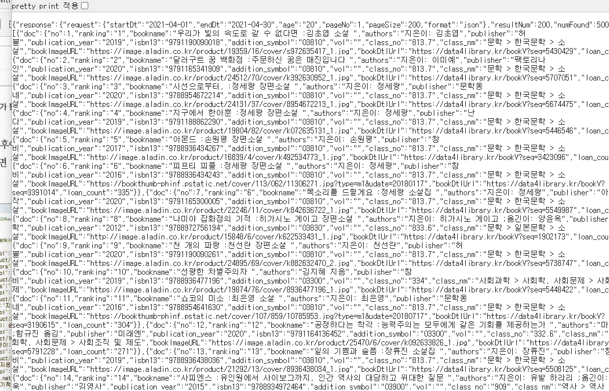
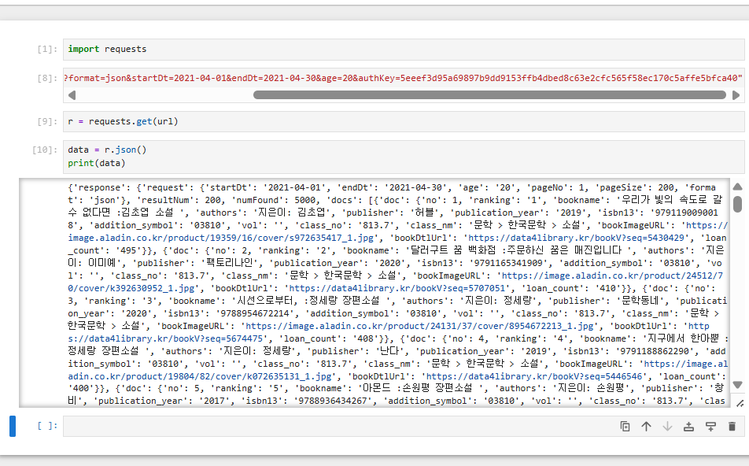
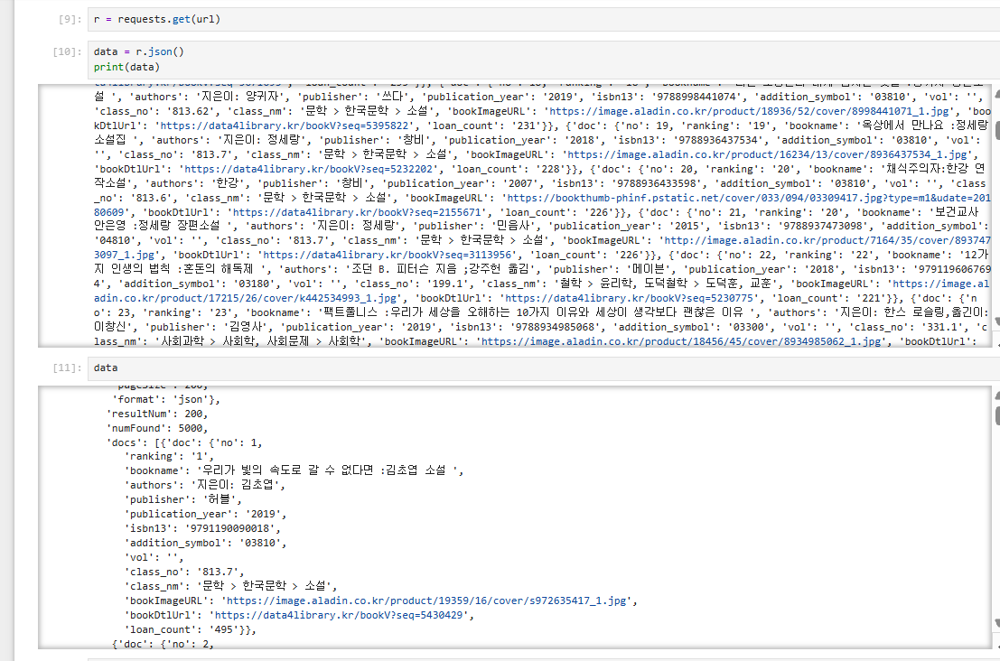
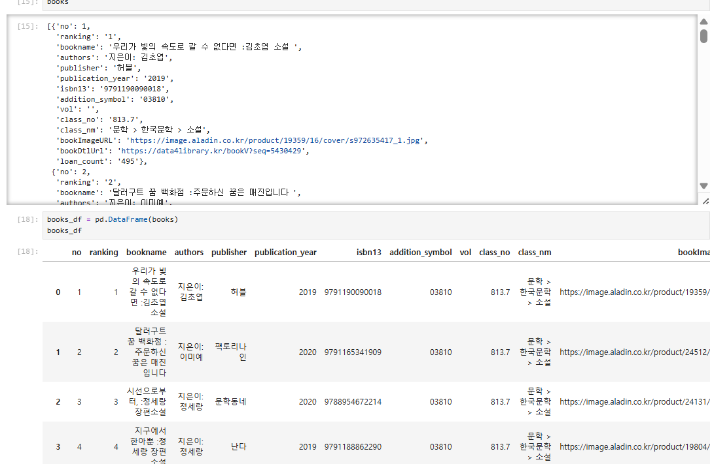
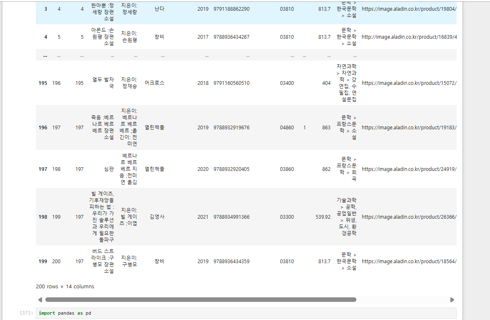
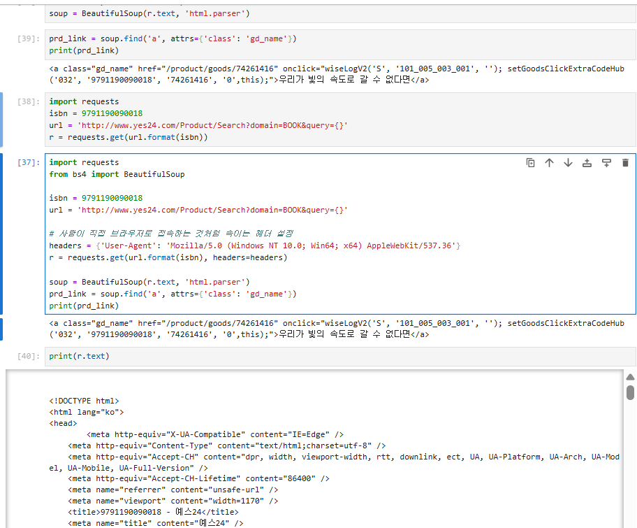

# 데이터분석 2주차 정규과제

📌데이터분석 정규과제는 매주 정해진 분량의 『*혼자 공부하는 데이터 분석 with 파이썬*』 을 읽고 학습하는 것입니다. 이번 주는 아래의 **DataAnalysis_2nd_TIL**에 나열된 분량을 읽고 공부하시면 됩니다.

아래의 문제를 풀어보며 학습 내용을 점검하세요. 문제를 해결하는 과정에서 개념을 스스로 정리하고, 필요한 경우 제시된 강의를 참고하여 보완하는 것이 좋습니다.

<!-- 강의 링크는 아래와 같습니다.
https://www.youtube.com/watch?v=s_-VvTLb3gs&list=PLVsNizTWUw7FGzSRCkQrPEEe-ljVXgS7k&index=4
https://www.youtube.com/watch?v=Il6L8OtNFpc&list=PLVsNizTWUw7FGzSRCkQrPEEe-ljVXgS7k&index=5
-->


## DataAnalysis_2nd_TIL

### 2장 데이터 수집하기
#### 01. API 사용하기
#### 02. 웹 스크래핑 사용하기


## Study Schedule

| 주차  | 공부 범위     | 완료 여부 |
| ----- | ------------- | --------- |
| 1주차 | p.24~81    | ✅         |
| 2주차 | p.84~151   | ✅         |
| 3주차 | p.154~219  | 🍽️         |
| 4주차 | p.222~279 | 🍽️         |
| 5주차 | p.282~325 | 🍽️         |
| 6주차 | p.328~379 | 🍽️         |
| 7주차 | p.382~430 | 🍽️         |

<br>

<!-- 여기까진 그대로 둬 주세요-->


# 1️⃣ 개념 정리 

## 01. API 사용하기

<1. API : 인증된 url만 있으면 언제든지 필요한 데이터에 편리하게 접근할 수 있는 방식. 두 프로그램이 서로 대화하기 위한 방법을 정의한 것
 2. HTTP : 인터넷에서 웹 페이지를 전송하는 기본 통신 방법.
 3. HTML :  웹 브라우저가 화면에 표시할 수 있는 문서의 한 종류이スト 웹 페이지를 위한 표준 언어.
 4. JSON : JavaScript Object Notation의 약자 
 5. XML : extensible Markup Language의 약자 >

## 02.웹 스크래핑 사용하기

<1. 웹스크래핑, 웹크롤링 :프로그램으로 웹사이트의 페이지를 옮겨 가면서 데이터를 추출하는 작업
 2.  뷰티플수프 : HTML 안에 있는 내용을 찾을 때 사용하는 패키지
 3. 웹 스크래핑 시 주의 사항 
 (1) 웹사이트에서 스크래핑을 허락하였는지 확인
 (2) HTML 태그를 특정할 수 있는지 확인
 4.>


# 2️⃣ 수행 인증

<




>


<br>
<br>

# 3️⃣ 확인 문제

## 문제 1.

> **🧚Q. 다음 중 BeautifulSoup 외에 웹 스크래핑에 사용할 수 있는 파이썬 패키지로 가장 적절한 것은 무엇인가요?**

```
1️⃣ NumPy  
2️⃣ Scrapy  
3️⃣ Matplotlib  
4️⃣ Scikit-learn  
```

```
2. Scrapy : 웹 사이트를 체계적으로 크롤링하고 데이터를 추출하는 데 최적화된 파이썬의 대표적인 오픈 소스 웹 스크래핑 프레임워크
1. NumPy (넘파이): 고성능 수치 계산을 위한 패키지로, 다차원 배열 및 행렬 수학 연산에 사용
3. Matplotlib (맷플롯립): 데이터 시각화를 위한 라이브러리로, 선 그래프, 막대그래프 등 다양한 차트를 그릴 때 사용
4. Scikit-learn (사이킷런): 머신러닝 모델을 만들고 훈련시키는 데 사용되는 대표적인 기계 학습 라이브러리
```


### 🎉 수고하셨습니다.