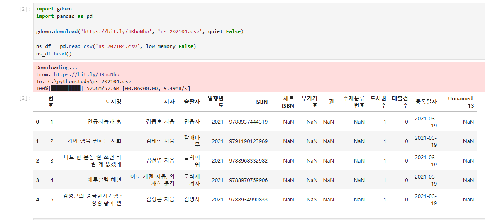
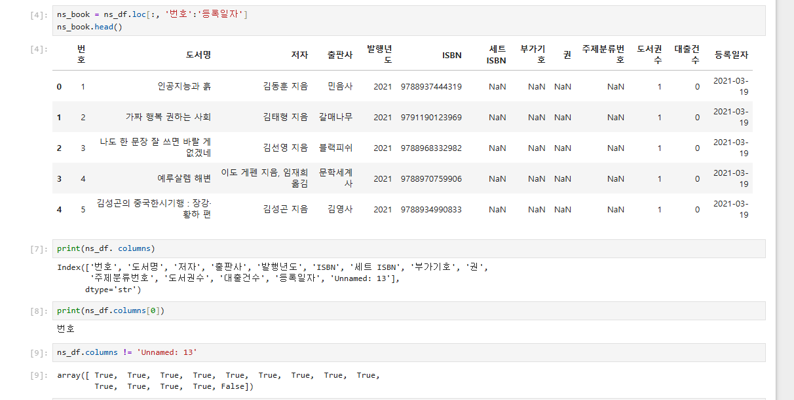
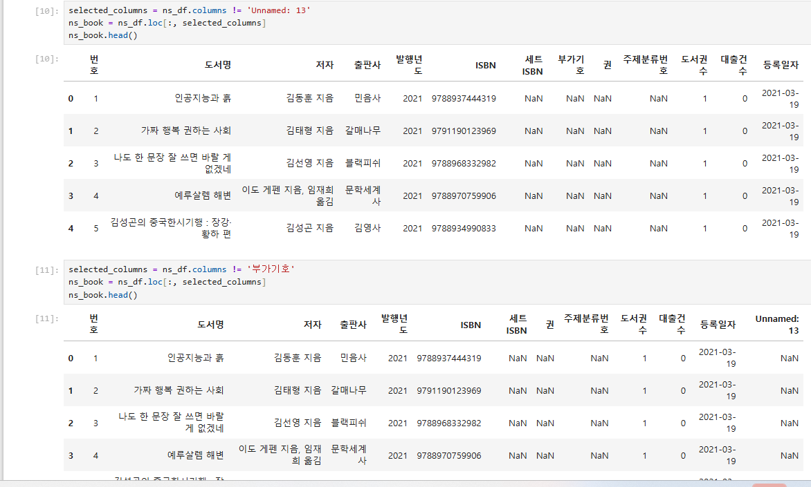
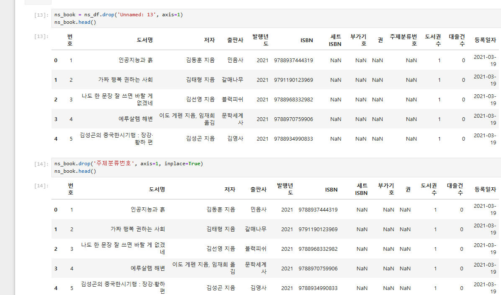
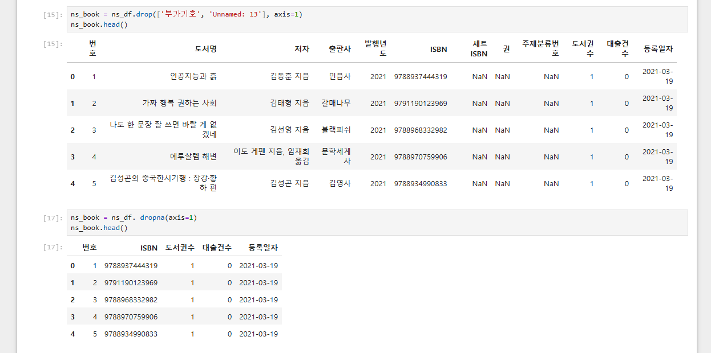
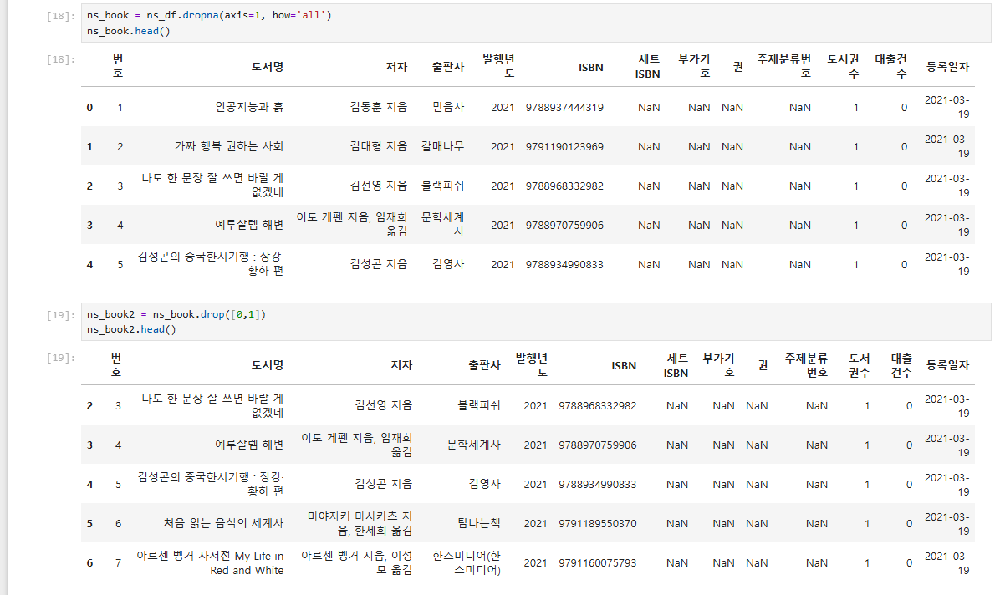
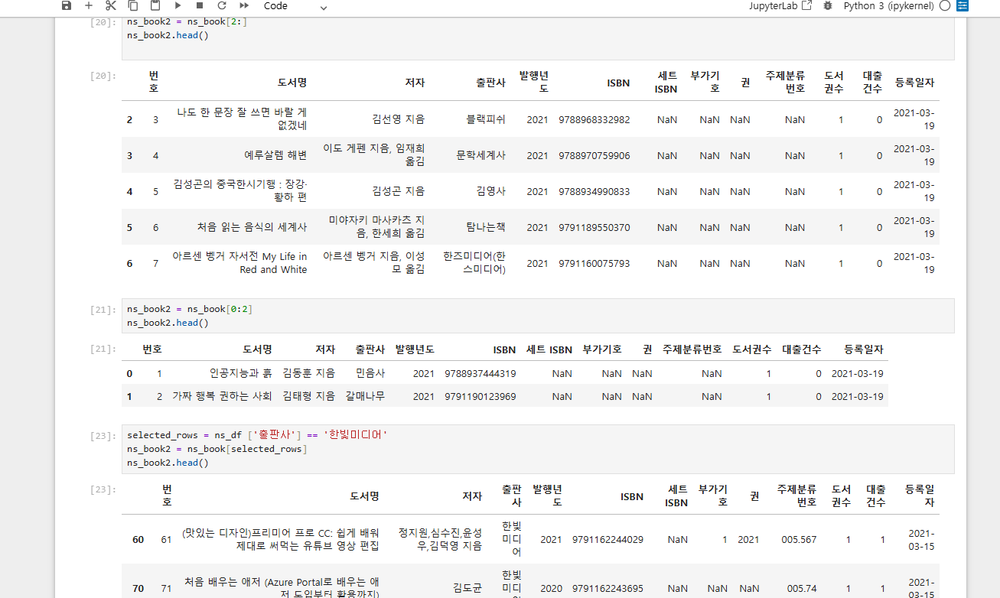
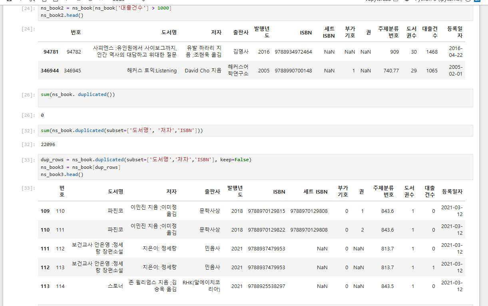

# 데이터분석 3주차 정규과제

📌데이터분석 정규과제는 매주 정해진 분량의 『*혼자 공부하는 데이터 분석 with 파이썬*』 을 읽고 학습하는 것입니다. 이번 주는 아래의 **DataAnalysis_3rd_TIL**에 나열된 분량을 읽고 공부하시면 됩니다.

아래의 문제를 풀어보며 학습 내용을 점검하세요. 문제를 해결하는 과정에서 개념을 스스로 정리하고, 필요한 경우 제시된 강의를 참고하여 보완하는 것이 좋습니다.

<!-- 강의 링크는 아래와 같습니다.
https://www.youtube.com/watch?v=CE3_InvbmLY&list=PLVsNizTWUw7FGzSRCkQrPEEe-ljVXgS7k&index=6
https://www.youtube.com/watch?v=hhbzUEQWdTg&list=PLVsNizTWUw7FGzSRCkQrPEEe-ljVXgS7k&index=7
-->


## DataAnalysis_3rd_TIL

### 3장 데이터 정제하기
#### 01. 불필요한 데이터 삭제하기
#### 02. 잘못된 데이터 수정하기


## Study Schedule

| 주차  | 공부 범위     | 완료 여부 |
| ----- | ------------- | --------- |
| 1주차 | p.24~81    | ✅         |
| 2주차 | p.84~151   | ✅         |
| 3주차 | p.154~219  | ✅         |
| 4주차 | p.222~279 | 🍽️         |
| 5주차 | p.282~325 | 🍽️         |
| 6주차 | p.328~379 | 🍽️         |
| 7주차 | p.382~430 | 🍽️         |

<br>

<!-- 여기까진 그대로 둬 주세요-->


# 1️⃣ 개념 정리 


## 01. 불필요한 데이터 삭제하기

<데이터 분석을 하기 전에는 분석에 필요하지 않은 행이나 열을 삭제해 데이터프레임을 정리할 수 있다. 판다스에서는 `drop()` 메서드를 사용한다.

열을 삭제할 때는 삭제할 컬럼명을 넣고 `axis=1`을 지정한다.

```python
df = df.drop('컬럼명', axis=1)
여러 개의 열을 삭제할 때는 리스트 형태로 컬럼명을 넣는다.
df = df.drop(['컬럼1', '컬럼2'], axis=1)
행을 삭제할 때는 인덱스 번호를 기준으로 삭제한다.
df = df.drop(0)>

## 02. 잘못된 데이터 수정하기

<데이터에는 중복값, 결측치, 잘못 입력된 값, 형식이 맞지 않는 값이 포함될 수 있다. 이런 데이터를 그대로 사용하면 분석 결과가 왜곡될 수 있으므로 수정하거나 제거해야 한다.
먼저 info()를 사용하면 데이터프레임의 컬럼명, 결측치 여부, 데이터 타입을 확인할 수 있다.
df.info()
결측치는 isna()를 사용해 확인할 수 있다. 결측치가 있는 값은 True, 결측치가 아닌 값은 False로 표시된다.df.isna()
df.isna().sum()
결측치를 삭제할 때는 dropna()를 사용한다.
df = df.dropna()
결측치를 특정 값으로 채울 때는 fillna()를 사용한다.
df['컬럼명'] = df['컬럼명'].fillna(0)
잘못 입력된 값을 바꿀 때는 replace()를 사용할 수 있다.
df['컬럼명'] = df['컬럼명'].replace('기존값', '새로운값')
특정 조건에 맞는 데이터만 찾을 때는 loc과 조건식을 함께 사용할 수 있다.
df.loc[df['컬럼명'] == '값']
문자열 데이터에서 특정 글자가 포함된 행을 찾을 때는 contains()를 사용할 수 있다.
df[df['컬럼명'].str.contains('찾을문자', na=False)]>```


# 2️⃣ 수행 인증











<br>
<br>

# 3️⃣ 확인 문제

## 문제 1.

> **🧚Q. 다음 두 데이터프레임 df1, df2를 합쳐서 데이터프레임 df3를 만들려고 합니다.**  
> 적절한 판다스 명령을 선택해주세요.

<table>
<tr>

<td>

### df1

| index | col1 | col2 |
|-------|------|------|
| 0     | x    | 5    |
| 1     | y    | 6    |
| 2     | z    | 7    |

</td>

<td>

### df2

| index | col3 | col4 |
|-------|------|------|
| 0     | x    | 50   |
| 1     | y    | 60   |
| 2     | w    | 70   |

</td>

<td align="center" valign="middle">

<h2> ➜ </h2>

</td>

<td>

### df3 (결과)

| index | col1 | col2 | col3 | col4 |
|-------|------|------|------|------|
| 0     | x    | 5.0  | x    | 50.0 |
| 1     | y    | 6.0  | y    | 60.0 |
| 2     | z    | 7.0  | NaN  | NaN  |
| 3     | NaN  | NaN  | w    | 70.0 |

</td>

</tr>
</table>

```
1️⃣ pd.merge(df1, df2)
2️⃣ pd.merge(df1, df2, how='left')
3️⃣ pd.merge(df1, df2, left_on='col1', right_on='col3', how='outer')
4️⃣ pd.merge(df1, df2, left_on='col1', right_on='col3', how='inner')
```

```
정답은 3️⃣ pd.merge(df1, df2, left_on='col1', right_on='col3', how='outer')
이유는 df1의 col1과 df2의 col3 값을 기준으로 합쳐야 하고, 결과에 x, y처럼 공통으로 있는 값뿐만 아니라 z, w처럼 한쪽에만 있는 값도 모두 포함되어야 하기 때문
```


### 🎉 수고하셨습니다.