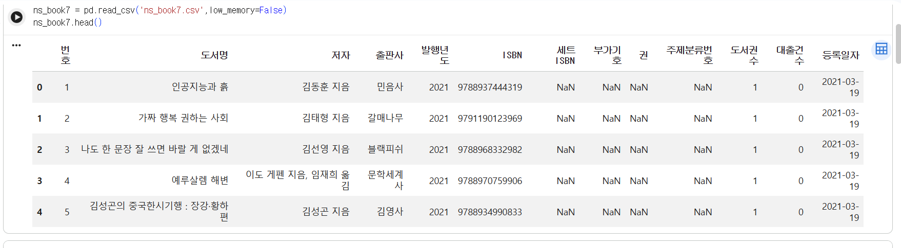
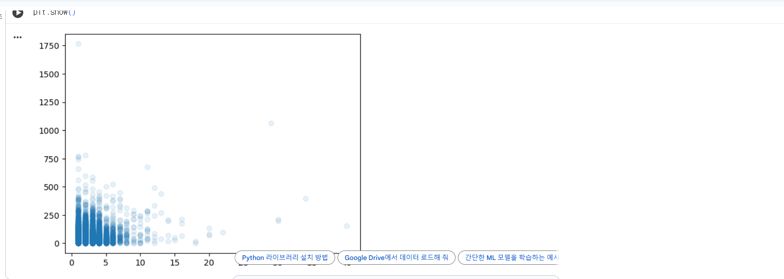
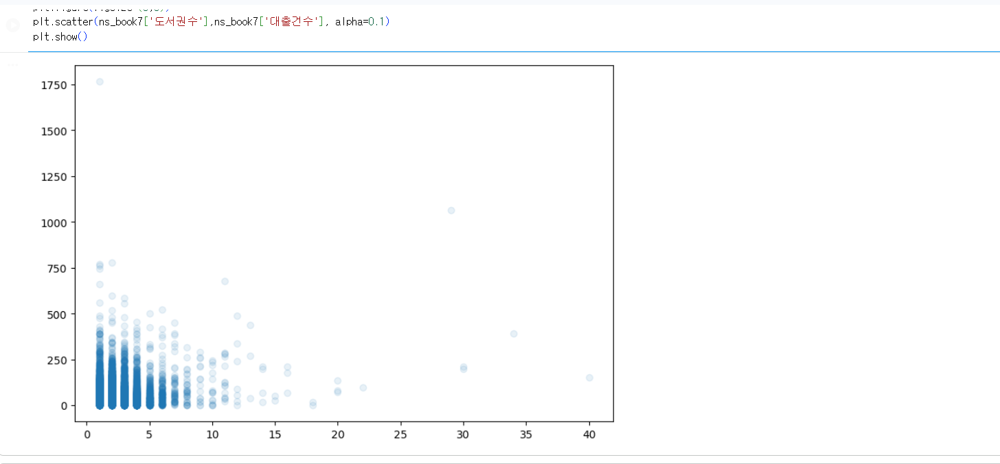
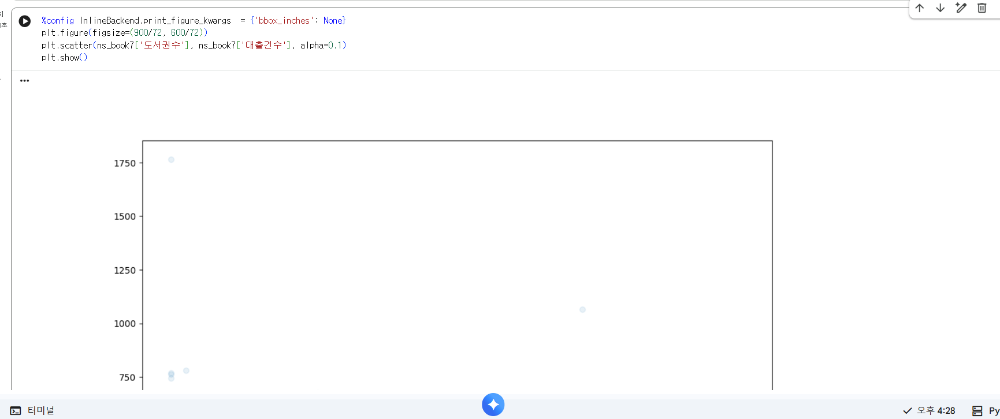

# 데이터분석 5주차 정규과제

📌데이터분석 정규과제는 매주 정해진 분량의 『*혼자 공부하는 데이터 분석 with 파이썬*』 을 읽고 학습하는 것입니다. 이번 주는 아래의 **DataAnalysis_5th_TIL**에 나열된 분량을 읽고 공부하시면 됩니다.

아래의 문제를 풀어보며 학습 내용을 점검하세요. 문제를 해결하는 과정에서 개념을 스스로 정리하고, 필요한 경우 제시된 강의를 참고하여 보완하는 것이 좋습니다.

<!-- 강의 링크는 아래와 같습니다.
https://www.youtube.com/watch?v=ho0LZ6GWhtc&list=PLVsNizTWUw7FGzSRCkQrPEEe-ljVXgS7k&index=10
https://www.youtube.com/watch?v=deYY4xHsI0o&list=PLVsNizTWUw7FGzSRCkQrPEEe-ljVXgS7k&index=11
-->


## DataAnalysis_5th_TIL

### 5장 데이터 시각화하기
#### 01. 맷플롯립 기본 요소 알아보기
#### 02. 선 그래프와 막대 그래프 그리기


## Study Schedule

| 주차  | 공부 범위     | 완료 여부 |
| ----- | ------------- | --------- |
| 1주차 | p.24~81    | ✅         |
| 2주차 | p.84~151   | ✅         |
| 3주차 | p.154~219  | ✅         |
| 4주차 | p.222~279 | ✅         |
| 5주차 | p.282~325 | ✅         |
| 6주차 | p.328~379 | 🍽️         |
| 7주차 | p.382~430 | 🍽️         |

<br>

<!-- 여기까진 그대로 둬 주세요-->


# 1️⃣ 개념 정리 

## 01. 맷플롯립 기본 요소 알아보기

<맷플롯립은 파이썬에서 데이터를 시각화할 때 사용하는 대표적인 라이브러리이다. 보통 `matplotlib.pyplot`을 `plt`라는 이름으로 불러와 사용한다.

그래프를 그릴 때는 먼저 `plt.figure()`로 그래프의 크기를 정할 수 있고, `plt.title()`로 제목을 설정할 수 있다. 또한 `plt.xlabel()`, `plt.ylabel()`을 사용해 x축과 y축 이름을 붙일 수 있다. 마지막에는 `plt.show()`를 사용해 그래프를 화면에 출력한다.

맷플롯립에서는 그래프의 크기, 색상, 선 모양, 축 이름, 범례 등을 설정하여 데이터를 더 이해하기 쉽게 표현할 수 있다. 단순히 숫자로만 데이터를 확인하는 것보다 그래프로 나타내면 값의 변화나 분포를 더 직관적으로 파악할 수 있다.
>

## 02. 선 그래프와 막대 그래프 그리기

<선 그래프는 시간의 흐름에 따른 변화나 연속적인 값의 추세를 확인할 때 유용하다. 맷플롯립에서는 `plt.plot()`을 사용하여 선 그래프를 그릴 수 있다. 예를 들어 월별 매출, 연도별 변화, 시간에 따른 값의 증가와 감소를 표현할 때 적합하다.

막대 그래프는 항목별 크기를 비교할 때 사용한다. `plt.bar()`를 사용하면 세로 막대 그래프를 그릴 수 있고, 각 범주의 값 차이를 한눈에 비교할 수 있다. 예를 들어 지역별 판매량, 카테고리별 빈도, 집단별 평균값 등을 비교할 때 활용할 수 있다.

선 그래프는 변화의 흐름을 보는 데 강점이 있고, 막대 그래프는 항목 간 차이를 비교하는 데 강점이 있다. 따라서 분석하려는 데이터의 성격에 따라 적절한 그래프를 선택하는 것이 중요하다.>


# 2️⃣ 수행 인증

<


>


<br>
<br>

# 3️⃣ 확인 문제

## 문제 1.

> **🧚Q. 다음 데이터를 이용하여 matplotlib으로 선그래프를 그리는 코드를 작성해주세요.**
- x = [1, 2, 3, 4, 5]
- y = [2, 4, 6, 8, 10]
> 조건은 아래와 같습니다.
```
1️⃣ 제목은 "Linear Trend"로 설정해주세요.
2️⃣ x축 이름은 "X values"로 설정해주세요.
3️⃣ y축 이름은 "Y values"로 설정해주세요.
4️⃣ 마커(marker)를 포함하여 선그래프를 그려주세요.
```

```
import matplotlib.pyplot as plt

x = [1, 2, 3, 4, 5]
y = [2, 4, 6, 8, 10]

plt.plot(x, y, marker='o')
plt.title("Linear Trend")
plt.xlabel("X values")
plt.ylabel("Y values")
plt.show()
```


### 🎉 수고하셨습니다.