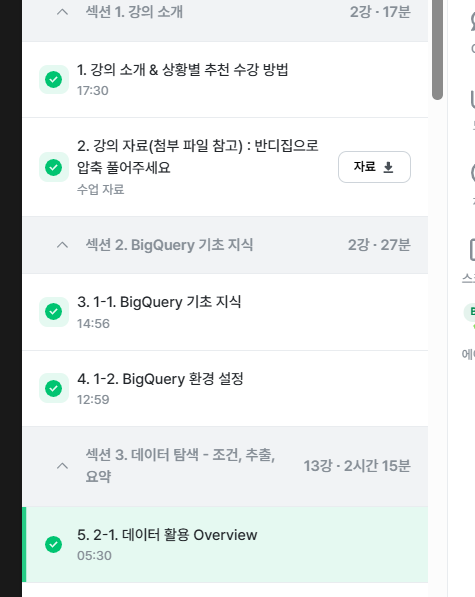

# 📘 SQL_BASIC 1주차 정규 과제

SQL_BASIC 정규 과제는 매주 정해진 분량의 `초보자를 위한 BigQuery(SQL) 입문` 강의를 듣고, 핵심 개념을 정리한 뒤 간단한 SQL 문제를 직접 풀어보는 방식으로 진행합니다.

이번 주는 BigQuery 환경과 SQL의 기본 구조를 익히고, 데이터가 어떤 형태로 저장되고 활용되는지 생각해봅니다.

완성된 과제는 Github에 업로드하고, 링크를 스프레드시트 'SQL' 시트에 입력해 제출해주세요.

**👀 수행 인증란은 필수입니다.**

---

## 📚 SQL_BASIC_1st_TIL

### 섹션 2. BigQuery 기초 지식

### 1-1. BigQuery 기초 지식

### 1-2. BigQuery 환경 설정

### 섹션 3. 데이터 탐색 - 조건, 추출, 요약

### 2-1. 데이터 활용 Overview

---

## ✨ 선택 강의

- 1. 강의 소개 & 상황별 추천 수강 방법 미리보기: 강의 전체 구성과 수강 방향을 확인하고 싶을 때 선택 수강

---

## 🏁 전체 강의 수강 계획

| 주차 | 필수 강의 범위 | 선택 강의 | 완료 여부 |
| --- | --- | --- | --- |
| 1주차 | 1-1 ~ 2-1 | 1 | ✅ |
| 2주차 | 2-2 ~ 2-3 | 2-4 | 🍽️ |
| 3주차 | 2-5, 2-7 ~ 2-8 | 2-6 | 🍽️ |
| 4주차 | 3-2 ~ 4-3 | 3-4 | 🍽️ |
| 5주차 | 4-4 ~ 4-6 | 4-5, 4-7 | 🍽️ |
| 6주차 | 5-2 ~ 5-5 | 5-6 | 🍽️ |
| 7주차 | 필수 강의 없음 | 6-2, 6-3, 6-4, 6-5 | 🍽️ |

---

<br>

<!-- 여기까진 그대로 둬 주세요-->

---

# 1️⃣ 개념 정리

아래 키워드 중 중요하다고 생각한 개념을 2개 이상 골라 짧게 정리해주세요. 3개보다 더 많이 정리하고 싶다면 자유롭게 항목을 추가해도 좋습니다.

이번 주 키워드:
- SQL
- BigQuery
- Database
- Table
- Row
- Column
- 데이터 활용 과정

## 01.

```
개념 이름: SQL
개념 설명: 데이터베이스에서 데이터를 가지고 올 때 사용하는 언어
활용 상황: 데이터베이스의 데이터를 관리하기 위해 설계된 특수 목적의 프로그래밍 언어로 쿼리문, 쿼리 구문, 쿼리를 짠다, sql쿼리 등으로 표현
```

## 02.

```
개념 이름: Row
개념 설명: 새로운 Row는 가로로 한 줄을 의미
활용 상황: 거래의 History에서 하나의 row가 거래
```

## (선택) 03.

```
개념 이름: Table
개념 설명: 데이터가 저장된 공간
활용 상황: Database 안의 저장된 데이터를 (앱,웹)에서 사용, 예시 - 음식배달 데이터
```

---

# 2️⃣ 수행 인증란

아래 중 하나 이상을 첨부해주세요.

- 강의 수강 화면 캡처
- 이번 주 학습 내용을 정리한 노트 캡처



---

# 3️⃣ 확인 문제

## 🧩 문제 1

포켓몬 게임이나 이커머스 산업과 같이 다양한 산업에서는 각기 다른 데이터가 존재합니다. 다음 중 하나의 산업을 선택하고, 해당 산업에서 수집하고 활용될 수 있는 데이터 항목, 즉 컬럼 5가지를 자유롭게 상상하여 나열해주세요.

예시 산업:
- 온라인 음식 배달
- 스마트 헬스 케어
- 중고 거래 앱
- 교육 플랫폼

풀이 과정:

```
- 선택한 산업: 교육 플랫폼
- 떠올린 컬럼 5가지: user_id, course_id, learning_date, completion_rate, quiz_score
- 해당 컬럼이 필요하다고 생각한 이유 : 누가 어떤 강의를 수강했는지 구분하고,강의 수강자의 학습빈도와 진행도를 확인할 수 있습니다. 이를 통해 학습량과 성취도의 관계를 살펴보고, 이용자에게 적절한 강의를 추천하거나 중도 이탈을 방지할 수 있습니다. 
```

## 🧩 문제 2

이번 강의를 통해 SQL이 왜 필요하다고 느끼는지, SQL을 통해 본인이 어떤 것을 해내고 싶은지를 자유롭게 작성해주세요.

풀이 과정: 

```
- SQL이 필요하다고 느낀 이유: 실제 데이터는 많은 행과 테이블로 구성되어 있으므로, 필요한 데이터만 추출하기 위해서는 SQL이 필요하다고 느꼈습니다.
- SQL로 해보고 싶은 일: 기업의 재무자료와 고객의 이용 데이터를 분석하여 집단별 특징에 따른 의사결정에 사용하고 싶습니다.
- 앞으로 SQL을 공부할 때 기대되는 점: 데이터를 직접 추출할 수 있게 되면, Python과 함께 수행할 수 있을 것 같습니다.
```

---

# 4️⃣ 이번 주 회고

```
1. SQL을 처음 써보면서 가장 낯설었던 점: BigQuery에서 프로젝트·데이터세트·테이블을 만들고, 각 필드의 데이터 유형과 파티션을 설정하는 과정이 낯설었습니다.
2. 다음 주에 더 익숙해지고 싶은 부분: BigQuery에서 프로젝트·데이터세트·테이블을 만들고, 각 필드의 데이터 유형과 파티션을 설정하는 과정이 낯설었습니다.
3. 과제 진행 중 막혔던 부분이 있다면: 강의 영상과 현재 BigQuery 화면 구성이 달라 battle_datetime을 파티션 기준으로 설정하는 항목을 찾는 데 어려움이 있었습니다. 이후 ‘수집 시간으로 파티션 나누기’가 아닌 ‘필드로 파티션 나누기’를 선택해야 한다는 것을 확인해 해결했습니다.
```

수고하셨습니다!

