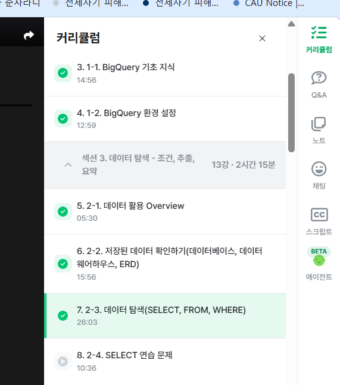
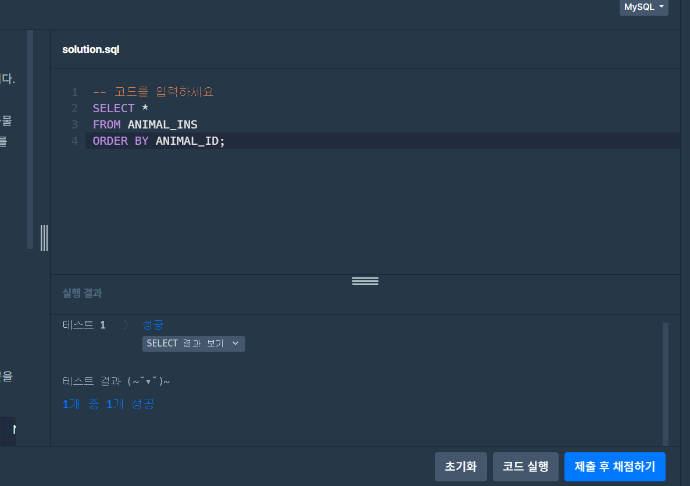
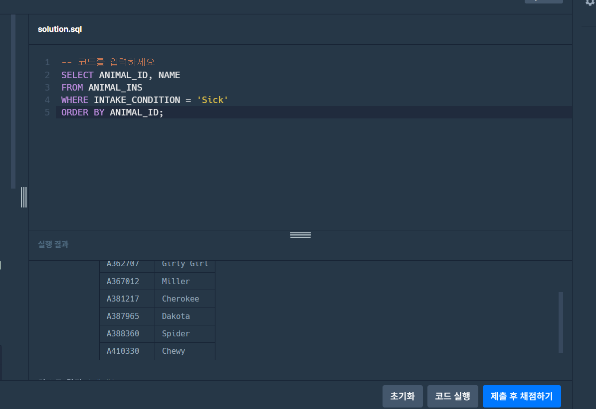

# 📘 SQL_BASIC 2주차 정규 과제

SQL_BASIC 정규 과제는 매주 정해진 분량의 `초보자를 위한 BigQuery(SQL) 입문` 강의를 듣고, 핵심 개념을 정리한 뒤 간단한 SQL 문제를 직접 풀어보는 방식으로 진행합니다.

이번 주는 저장된 데이터를 확인하는 방법과 `SELECT`, `FROM`, `WHERE`의 기본 구조를 학습합니다.

완성된 과제는 Github에 업로드하고, 링크를 스프레드시트 'SQL' 시트에 입력해 제출해주세요.

**👀 수행 인증란은 필수입니다.**

---

## 📚 SQL_BASIC_2nd_TIL

### 섹션 3. 데이터 탐색 - 조건, 추출, 요약

### 2-2. 저장된 데이터 확인하기(데이터베이스, 데이터 웨어하우스, ERD)

### 2-3. 데이터 탐색(SELECT, FROM, WHERE)

---

## ✨ 선택 강의

- 2-4. SELECT 연습 문제: SELECT, FROM, WHERE를 더 연습하고 싶을 때 선택 수강

---

## 🏁 전체 강의 수강 계획

| 주차 | 필수 강의 범위 | 선택 강의 | 완료 여부 |
| --- | --- | --- | --- |
| 1주차 | 1-1 ~ 2-1 | 1 | ✅ |
| 2주차 | 2-2 ~ 2-3 | 2-4 | ✅ |
| 3주차 | 2-5, 2-7 ~ 2-8 | 2-6 | 🍽️ |
| 4주차 | 3-2 ~ 4-3 | 3-4 | 🍽️ |
| 5주차 | 4-4 ~ 4-6 | 4-5, 4-7 | 🍽️ |
| 6주차 | 5-2 ~ 5-5 | 5-6 | 🍽️ |
| 7주차 | 필수 강의 없음 | 6-2, 6-3, 6-4, 6-5 | 🍽️ |

---

<br>

<!-- 여기까진 그대로 둬 주세요-->

---

# 1️⃣ 개념 정리

아래 키워드 중 중요하다고 생각한 개념을 2개 이상 골라 짧게 정리해주세요. 3개보다 더 많이 정리하고 싶다면 자유롭게 항목을 추가해도 좋습니다.

이번 주 키워드:
- SELECT
- FROM
- WHERE
- 조건식
- ORDER BY
- LIMIT
- 테이블 구조 확인

## 01.

```
개념 이름: SELECT
개념 설명:  테이블에서 조회하여 결과로 출력할 컬럼을 지정하는 명령어. Table에 저장되어 있는 컬럼 선택. 여러 컬럼 명시 가능.
FROM Table AS t1
예시 쿼리: SELECT id, kor_name
FROM basic.pokemon;
```

## 02.

```
개념 이름: FROM
개념 설명: Dataset.table : 어떤 테이블에서 데이터를 확인할 것인가. 데이터를 확인할 Table 명시 
이름이 너무 길다면 AS "별칭"으로 별칭 지정 가능
예시 쿼리:SELECT *
FROM basic.pokemon;
```

## (선택) 03.

```
개념 이름: WHERE
개념 설명: 만약 원하는 조건이 있다면 어떤 조건인가?
FROM에 명시된 Table에 저장된 데이터를 필터링, Table에 있는 컬럼을 조건 설정
헷갈린 점:
```

---

# 2️⃣ 수행 인증란

아래 중 하나 이상을 첨부해주세요.



---

# 3️⃣ 확인 문제

프로그래머스는 로그인이 필요하므로, 로그인 후 문제 풀이를 진행해주세요.

## 🧩 문제 1

문제 링크: [모든 레코드 조회하기](https://school.programmers.co.kr/learn/courses/30/lessons/59034)

풀이 과정:

```
- 테이블에서 확인한 컬럼: ANIMAL_ID, ANIMAL_TYPE, DATETIME, INTAKE_CONDITION, NAME, SEX_UPON_INTAKE
- SELECT와 FROM을 작성한 방식: SELECT와 FROM을 작성한 방식: SELECT *를 사용하여 모든 컬럼을 선택하고, FROM ANIMAL_INS를 작성하여 데이터를 가져올 테이블을 지정했습니다. 문제에서 동물 ID 순으로 조회하도록 요구했기 때문에 ORDER BY ANIMAL_ID를 추가했습니다.
- 새로 배운 점: 새로 배운 점: SELECT 뒤의 *는 테이블의 모든 컬럼을 조회한다는 의미이며, ORDER BY를 사용하면 특정 컬럼을 기준으로 데이터를 정렬할 수 있다는 점을 배웠습니다.
```



## 🧩 문제 2

문제 링크: [아픈 동물 찾기](https://school.programmers.co.kr/learn/courses/30/lessons/59036)

풀이 과정:

```
- 문제에서 요구한 조건: 보호소에 들어올 당시 상태가 아픈 동물의 아이디와 이름을 조회하고, 결과를 동물 아이디 순으로 정렬해야 합니다.
- WHERE 절로 옮긴 방식: 아픈 상태는 INTAKE_CONDITION 컬럼에 Sick으로 저장되어 있으므로 WHERE INTAKE_CONDITION = 'Sick'으로 작성했습니다.
- 정렬 기준이 있다면 사용한 기준: ANIMAL_ID를 기준으로 오름차순 정렬하기 위해 ORDER BY ANIMAL_ID를 사용했습니다.
- 새로 배운 점: WHERE를 사용하면 특정 조건을 만족하는 행만 조회할 수 있고, 문자 조건인 Sick은 작은따옴표로 감싸야 한다는 점을 배웠습니다.
```




---

# 4️⃣ 이번 주 회고

```
1. SELECT, FROM, WHERE 중 가장 헷갈린 개념: 각각의 명령어 순서
2. 문제를 풀 때 가장 자주 확인하게 된 부분: 명령어가 뭐가 먼저였는지...
3. 다음 주 문제 풀이에서 의식하고 싶은 습관: 순서 & 컬럼의 이름
```

수고하셨습니다!


