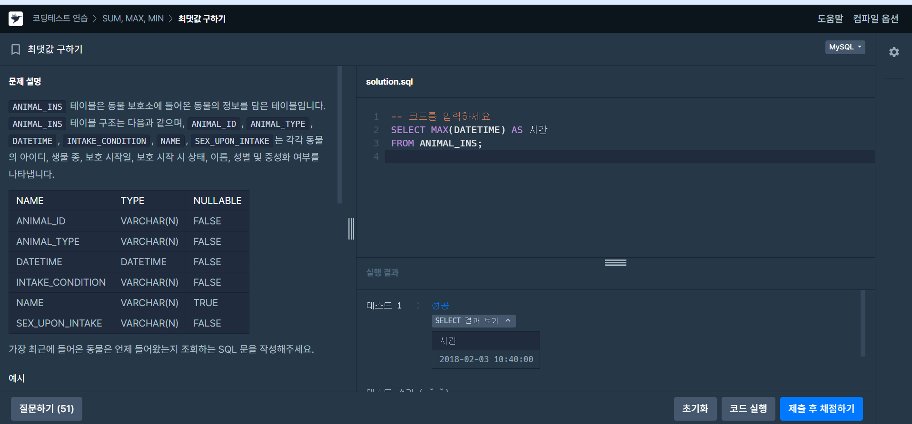

# 📘 SQL_BASIC 3주차 정규 과제

SQL_BASIC 정규 과제는 매주 정해진 분량의 `초보자를 위한 BigQuery(SQL) 입문` 강의를 듣고, 핵심 개념을 정리한 뒤 간단한 SQL 문제를 직접 풀어보는 방식으로 진행합니다.

이번 주는 집계 함수와 `GROUP BY`, `HAVING`을 학습합니다.

완성된 과제는 Github에 업로드하고, 링크를 스프레드시트 'SQL' 시트에 입력해 제출해주세요.

**👀 수행 인증란은 필수입니다.**

---

## 📚 SQL_BASIC_3rd_TIL

### 섹션 3. 데이터 탐색 - 조건, 추출, 요약

### 2-5. 집계(GROUP BY + HAVING + SUM/COUNT)

### 2-7. 정리

### 2-8. 새로운 집계 함수 소개(GROUP BY ALL, 2024-02-26에 나온 함수)

---

## ✨ 선택 강의

- 2-6. 연습 문제: 집계와 조건 조회를 더 연습하고 싶을 때 선택 수강

---

## 🏁 전체 강의 수강 계획

| 주차 | 필수 강의 범위 | 선택 강의 | 완료 여부 |
| --- | --- | --- | --- |
| 1주차 | 1-1 ~ 2-1 | 1 | ✅ |
| 2주차 | 2-2 ~ 2-3 | 2-4 | ✅ |
| 3주차 | 2-5, 2-7 ~ 2-8 | 2-6 | ✅ |
| 4주차 | 3-2 ~ 4-3 | 3-4 | 🍽️ |
| 5주차 | 4-4 ~ 4-6 | 4-5, 4-7 | 🍽️ |
| 6주차 | 5-2 ~ 5-5 | 5-6 | 🍽️ |
| 7주차 | 필수 강의 없음 | 6-2, 6-3, 6-4, 6-5 | 🍽️ |

---

<br>

<!-- 여기까진 그대로 둬 주세요-->

---

# 1️⃣ 개념 정리

아래 키워드 중 중요하다고 생각한 개념을 2개 이상 골라 짧게 정리해주세요. 3개보다 더 많이 정리하고 싶다면 자유롭게 항목을 추가해도 좋습니다.

이번 주 키워드:
- COUNT
- SUM
- AVG
- MAX
- MIN
- GROUP BY
- HAVING
- 집계 기준

## 01.

```
개념 이름: GROUP BY
개념 설명: 같은 값끼리 모아서 그룹화한다, 특정 컬럼을 기준으로 모으면서 다른 컬럼에선 집계 가능
예시 쿼리: 합, 평균, MAX, MIN
```

## 02.

```
개념 이름: DISTINCT
개념 설명: 별개의 여러 값 중에 Unique 한 것만 보고 싶은 경우 사용
예시 쿼리: COUNT(DISTNCT user_id)
```

## (선택) 03.

```
개념 이름:
개념 설명:
헷갈린 점:
```

---

# 2️⃣ 수행 인증란

아래 중 하나 이상을 첨부해주세요.

- 강의 수강 화면 캡처
- 문제 풀이 정답 화면 캡처
- SQL 실행 결과 화면 캡처

---

# 3️⃣ 확인 문제

프로그래머스는 로그인이 필요하므로, 로그인 후 문제 풀이를 진행해주세요.

## 🧩 문제 1

문제 링크: [최댓값 구하기](https://school.programmers.co.kr/learn/courses/30/lessons/59415)

풀이 과정:

```
- 문제 요구사항: 가장 최근에 들어온 동물은 언제 들어왔는지 조회하는 SQL 문을 작성해주세요
- 사용한 SQL 절: SELECT MAX(DATETIME) AS 시간
FROM ANIMAL_INS;
- 새로 배운 점:MAX
```

< >

## 🧩 문제 2

문제 링크: [가장 비싼 상품 구하기](https://school.programmers.co.kr/learn/courses/30/lessons/131697)

풀이 과정:

```
- 사용한 집계 함수: `MAX`
- 집계 대상 컬럼: `PRICE`
- 결과를 검증한 방법: 쿼리를 실행한 뒤 `PRODUCT` 테이블의 가장 높은 판매가가 하나의 값으로 출력되는지 확인
```

<>

## 🧩 문제 3

문제 링크: [고양이와 개는 몇 마리 있을까](https://school.programmers.co.kr/learn/courses/30/lessons/59040)

풀이 과정:SELECT ANIMAL_TYPE, COUNT(*) AS count
FROM ANIMAL_INS
WHERE ANIMAL_TYPE IN ('Cat', 'Dog')
GROUP BY ANIMAL_TYPE
ORDER BY ANIMAL_TYPE;

```
- 그룹화 기준:`ANIMAL_TYPE`별로 그룹화하여 고양이와 개의 수를 각각 계산
- WHERE와 HAVING 중 사용한 절:`WHERE`절을 사용해 집계하기 전에 `Cat`과 `Dog`에 해당하는 데이터만 선택
- 처음 틀렸다면 틀린 이유: `COUNT(*)`와 함께 `GROUP BY ANIMAL_TYPE`을 사용해야 한다는 점
- 새로 배운 SQL 패턴 : `WHERE`로 필요한 행을 선택한 후 `GROUP BY`로 묶고, `COUNT(*)`로 그룹별 개수를 계산
```

<>

---

# 4️⃣ 이번 주 회고

```
1. 문제를 SQL로 옮길 때 가장 어려웠던 부분:문제에서 요구하는 기준에 따라 데이터를 그룹화하고, 각 그룹에 `COUNT`, `MAX` 등의 집계 함수를 적용
2. WHERE와 HAVING의 차이를 어떻게 이해했는지: `WHERE`는 그룹화하기 전의 개별 행을 조건에 따라 걸러내고, `HAVING`은 `GROUP BY`로 묶은 결과를 집계값에 따라 걸러내는 절
3. 다음 주에 더 연습하고 싶은 문제 유형:
```

수고하셨습니다!


