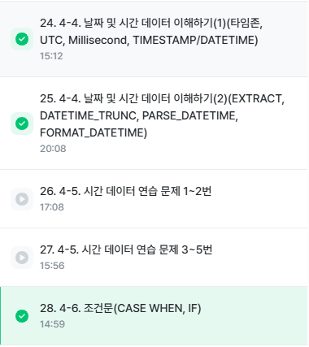
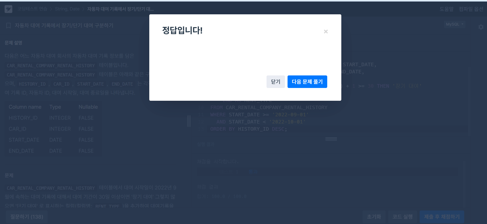
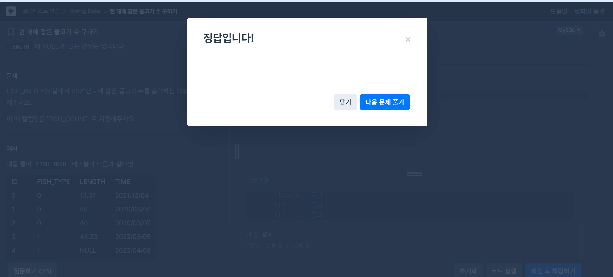
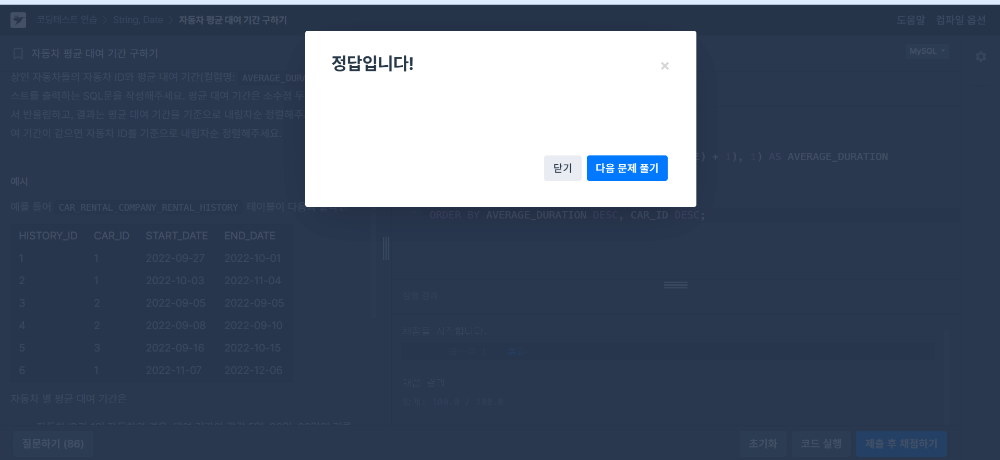

# 📘 SQL_BASIC 5주차 정규 과제

SQL_BASIC 정규 과제는 매주 정해진 분량의 `초보자를 위한 BigQuery(SQL) 입문` 강의를 듣고, 핵심 개념을 정리한 뒤 간단한 SQL 문제를 직접 풀어보는 방식으로 진행합니다.

이번 주는 날짜/시간 데이터와 조건문을 학습합니다. 특히 `CASE WHEN`은 SQL 문제 풀이와 데이터 분석에서 자주 사용되므로, 직접 분류 기준을 만들고 결과를 확인하는 연습을 해주세요.

완성된 과제는 Github에 업로드하고, 링크를 스프레드시트 'SQL' 시트에 입력해 제출해주세요.

**👀 수행 인증란은 필수입니다.**

---

## 📚 SQL_BASIC_5th_TIL

### 섹션 5. 데이터 탐색 - 변환

### 4-4. 날짜 및 시간 데이터 이해하기

### 4-6. 조건문(CASE WHEN, IF)

---

## ✨ 선택 강의

- 4-5. 시간 데이터 연습문제: 날짜/시간 함수를 더 연습하고 싶을 때 선택 수강
- 4-7. 조건문 연습문제: CASE WHEN과 IF를 더 연습하고 싶을 때 선택 수강

---

## 🏁 전체 강의 수강 계획

| 주차 | 필수 강의 범위 | 선택 강의 | 완료 여부 |
| --- | --- | --- | --- |
| 1주차 | 1-1 ~ 2-1 | 1 | ✅ |
| 2주차 | 2-2 ~ 2-3 | 2-4 | ✅ |
| 3주차 | 2-5, 2-7 ~ 2-8 | 2-6 | ✅ |
| 4주차 | 3-2 ~ 4-3 | 3-4 | ✅ |
| 5주차 | 4-4 ~ 4-6 | 4-5, 4-7 | ✅ |
| 6주차 | 5-2 ~ 5-5 | 5-6 | 🍽️ |
| 7주차 | 필수 강의 없음 | 6-2, 6-3, 6-4, 6-5 | 🍽️ |

---

<br>

<!-- 여기까진 그대로 둬 주세요-->

---

# 1️⃣ 개념 정리

아래 키워드 중 중요하다고 생각한 개념을 2개 이상 골라 짧게 정리해주세요. 3개보다 더 많이 정리하고 싶다면 자유롭게 항목을 추가해도 좋습니다.

이번 주 키워드:
- DATE
- DATETIME
- TIMESTAMP
- EXTRACT
- DATETIME_TRUNC
- FORMAT_DATETIME
- CASE WHEN
- IF

## 01.

```
개념 이름: Date
개념 설명: Date만 표시하는 데이터 
예시 쿼리: SELECT DATE '2026-10-01' AS date_value;
```

## 02.

```
개념 이름: Datetime
개념 설명: Date와 time까지 표시하는 데이터, 타임존 정보 없음
예시 쿼리: SELECT DATETIME '2026-10-01 15:30:00' AS datetime_value;
```

## (선택) 03.

```
개념 이름: timestamp
개념 설명: UTC부터 경과한 시간을 나타내는 것, TIME ZONE 정보 있음
헷갈린 점: DATETIME은 시간대 없이 날짜와 시간을 그대로 저장하고, TIMESTAMP는 시간대까지 고려한 실제 시점을 나타낸다는 점이 헷갈렸습니다.
```

---

# 2️⃣ 수행 인증란

아래 중 하나 이상을 첨부해주세요.

- 강의 수강 화면 캡처

- 문제 풀이 정답 화면 캡처
- SQL 실행 결과 화면 캡처

---

# 3️⃣ 확인 문제

프로그래머스는 로그인이 필요하므로, 로그인 후 문제 풀이를 진행해주세요.

## 🧩 문제 1

문제 링크: [자동차 대여 기록에서 장기/단기 대여 구분하기](https://school.programmers.co.kr/learn/courses/30/lessons/151138)

풀이 과정:

```
- 장기/단기 대여를 나눈 기준: 대여 기간이 30일 이상이면 '장기 대여', 30일 미만이면 '단기 대여'로 구분했습니다.
- 사용한 날짜 계산 방식:  DATEDIFF(END_DATE, START_DATE) + 1로 시작일과 종료일을 모두 포함한 대여 기간을 계산
- CASE WHEN으로 만든 컬럼: 대여 기간 조건에 따라 '장기 대여' 또는 '단기 대여'를 표시하는 RENT_TYPE 컬럼
```

<>

## 🧩 문제 2

문제 링크: [한 해에 잡은 물고기 수 구하기](https://school.programmers.co.kr/learn/courses/30/lessons/298516)

풀이 과정:

```
- 문제에서 요구한 연도: 2021년
- 사용한 날짜 조건: TIME 컬럼에서 YEAR(TIME) = 2021 조건을 사용
- 집계한 대상: 2021년에 잡힌 물고기 기록의 개수를 COUNT(*)로 집계
```

<>

## 🧩 문제 3

문제 링크: [조건에 부합하는 중고거래 상태 조회하기](https://school.programmers.co.kr/learn/courses/30/lessons/164672)

풀이 과정:

```
- 날짜 조건: CREATED_DATE가 2022년 10월 5일인 게시글만 조회
- CASE WHEN으로 바꾼 값:  STATUS가 SALE이면 '판매중', RESERVED이면 '예약중', DONE이면 '거래완료'
- ELSE에 해당하는 경우: 문제에서 제시한 SALE, RESERVED, DONE 외의 값이 들어올 경우를 대비해 기존 STATUS 값을 그대로 출력하도록 처리
- 정렬 기준: BOARD_ID를 기준으로 내림차순 정렬
```

<>

## 🧩 문제 4

문제 링크: [자동차 평균 대여 기간 구하기](https://school.programmers.co.kr/learn/courses/30/lessons/157342)

풀이 과정:

```
- GROUP BY 기준: 자동차별 평균 대여 기간을 구하기 위해 CAR_ID를 기준으로 그룹화
- 평균을 계산한 방식: DATEDIFF(END_DATE, START_DATE) + 1로 각 대여 기간을 계산한 뒤, AVG()로 평균을 구하고 ROUND(..., 1)로 소수점 첫째 자리까지 반올림
- HAVING에 사용한 조건: 평균 대여 기간이 7일 이상인 자동차만 출력하기 위해 HAVING AVERAGE_DURATION >= 7 조건을 사용
- 처음 헷갈렸던 점:  WHERE가 아니라 GROUP BY로 평균을 계산한 뒤 HAVING으로 조건
```

<>

---

# 4️⃣ 이번 주 회고

```
1. 날짜 함수 중 가장 헷갈린 함수:  DATEDIFF가 가장 헷갈렸습니다. 날짜 차이를 계산할 때 시작일과 종료일을 모두 포함해야 하는 문제에서는 단순 차이에 +1을 해야 한다는 점을 주의해야 했습니다.
2. CASE WHEN을 사용할 때 기억해야 할 문법: CASE WHEN 조건 THEN 결과 ELSE 결과 END AS 컬럼명 순서로 작성해야 한다는 점을 기억해야 합니다. 여러 조건이 있으면 WHEN을 여러 번 사용할 수 있고, 마지막에는 END로 닫아야 합니다.
3. 날짜/시간 데이터나 조건문을 활용해보고 싶은 분석 상황:  고객의 이용 기간이나 구매 시점을 기준으로 장기 이용 고객과 단기 이용 고객을 나누어 분석해보고 싶습니다. 예를 들어 일정 기간 이상 서비스를 이용한 고객을 장기 고객으로 분류하고, 이들의 구매 패턴이나 재방문 여부를 비교할 수 있을 것 같습니다.
```

수고하셨습니다!


